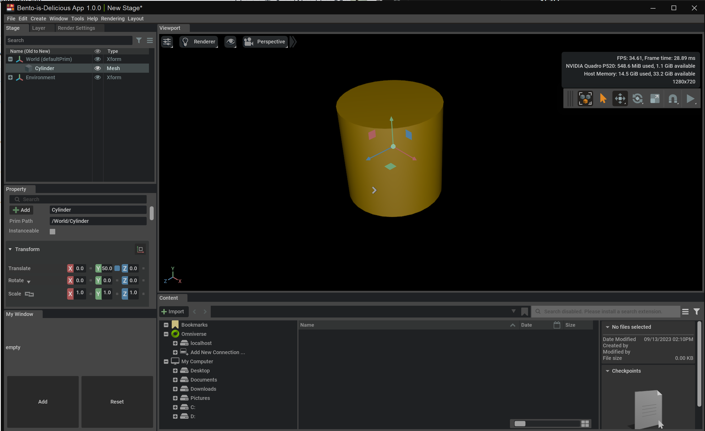

# My Demo Application from Essentials of Developing Omniverse Kit Applications Course

# How to Run the App

Open any code editor. For me, I personally prefer `VSCode`. 

1. download `jin-bento_editor@105.0+main.0.06d304f0.local.windows-x86_64.release.zip`.
2. (optional) rename to a shorter one or any name you're comfortable with. It doesn't effect the app. 
3. extract the file.
4. redirect to that directory.
5. open terminal and run `.\source\apps\jin.bento_editor.bat` (for windows).

# Here is what the application should look like

Drag around viewport as you want. 

# How to Read `.usd` file

1. from the window, click file -> open and select (for example, my) `bento.usd` file.

This will open your latest work as a `.usd` file. 
